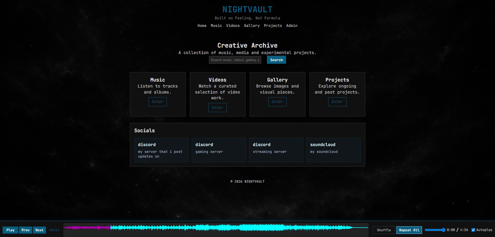
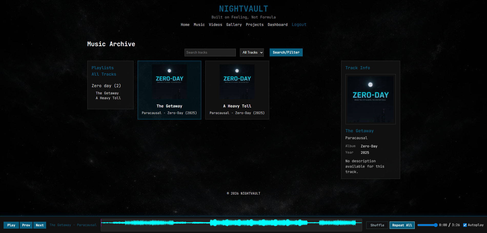
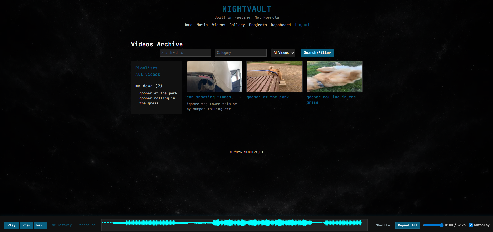
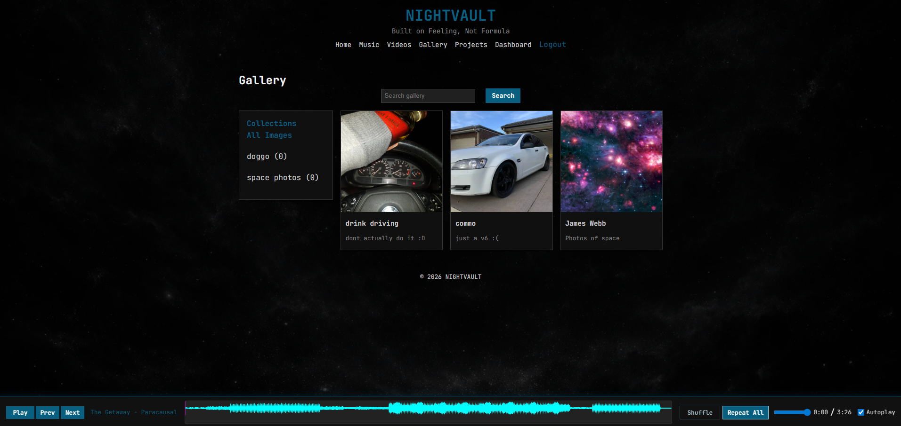
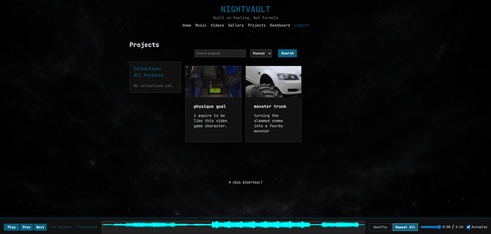
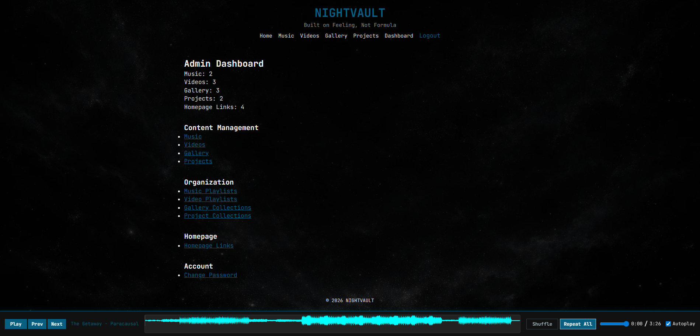

# NIGHTVAULT

**NIGHTVAULT** is a self-hosted creative archive and media management platform for music, videos, gallery work and projects, built with Node.js, Express, EJS, SQLite and a dark retro-inspired interface.

It is designed for individuals, artists, collectors and small creators who want a private or public-facing space to organise and publish their work without relying on third-party platforms.

## Features

- Public pages for Home, Music, Videos, Gallery and Projects
- Admin login with session-based authentication, CSRF protection and strict same-site session cookies
- Upload and manage:
  - music tracks and cover art
  - videos and thumbnails
  - gallery images
  - projects, hero images, documents and updates
- WAV music uploads are automatically converted to MP3 for faster web playback
- Playlists for music and videos
- Collections for gallery items and projects
- Global and section-based search and filtering
- SQLite database with automatic setup and seed support
- Persistent music player with waveform visualisation
- Project updates with file attachments
- Automatic cleanup of uploaded files when content is deleted
- Orphaned upload cleanup utility
- Responsive dark archive-style interface

## Screenshots

NIGHTVAULT combines a dark retro-inspired interface with a self-hosted media and project archive workflow.

### Home



### Music Library



### Video Archive



### Gallery Collections



### Projects and Updates



### Admin Dashboard



## Tech Stack

- Node.js
- Express
- EJS
- SQLite for both app data and session storage
- multer
- bcrypt
- express-session with persistent SQLite session store
- WaveSurfer.js

## Docker Setup

NIGHTVAULT can be run directly from the published Docker image.

### Create a folder for the deployment

Linux/macOS:

```bash
mkdir nightvault && cd nightvault
```

Windows CMD:

```cmd
mkdir nightvault
cd nightvault
```

### Create a `.env` file

Create a local `.env` file with at least:

```env
SESSION_SECRET=replace-this-with-a-long-random-secret
TRUST_PROXY=1
```

You can also use the full example from the [Environment Variables](#environment-variables) section below.

### Create `docker-compose.yml`

```yaml
services:
  nightvault:
    image: ghcr.io/uidcheck/nightvault:latest
    container_name: nightvault
    restart: unless-stopped
    ports:
      - "3000:3000"
    env_file:
      - .env
    environment:
      NODE_ENV: production
      PORT: 3000
      DB_PATH: /app/data/nightvault.db
    volumes:
      - ./data:/app/data
      - ./uploads:/app/uploads
```

### Create persistent data folders

These folders are mounted into the container so database content and uploads are not lost when recreating the container.

Linux/macOS:

```bash
mkdir -p data uploads
```

Windows CMD:

```cmd
mkdir data
mkdir uploads
```

### Pull and start the container

```bash
docker compose up -d
```

### Update to the latest image

```bash
docker compose pull
docker compose up -d
```

### Open the site

```text
http://localhost:3000
```

### View logs

```bash
docker compose logs -f
```

### Stop the container

```bash
docker compose down
```

## Run From Source

If you want to run NIGHTVAULT from source instead of Docker:

1. Clone or download the repository.
2. Change into the project folder.
3. Copy `.env.example` to `.env`.
4. Set a strong random value for `SESSION_SECRET` in `.env`.

Clone the repository:

```bash
git clone https://github.com/uidcheck/nightvault.git
cd nightvault
```

Install dependencies:

```bash
npm install
```

Start the application:

```bash
npm start
```

On first startup, the app will automatically:

- create the SQLite database file if it does not exist
- initialise all required tables and indexes
- expose a one-time setup page at `/setup` when no admin account exists

Open the site in your browser:

```text
http://localhost:3000
```

On a fresh install with no admin account, open `/setup` and create the initial admin username and password.

If `INITIAL_ADMIN_USERNAME` and `INITIAL_ADMIN_PASSWORD` are both set when the app starts, NIGHTVAULT creates that first admin automatically and skips the web setup flow.

After setup is complete, sign in at `/login`.

Existing installs that already have an admin account keep the current login flow and do not show `/setup`.

## Environment Variables

Create a local `.env` file based on `.env.example`.

Example:

```env
PORT=3000
SESSION_SECRET=replace-this-with-a-long-random-secret
TRUST_PROXY=1
# Optional: bootstrap the first admin account on startup when no admin exists
# INITIAL_ADMIN_USERNAME=yourname
# INITIAL_ADMIN_PASSWORD=replace-this-with-a-strong-password
# Optional: override SQLite file path (default: database/nightvault.db)
# DB_PATH=database/nightvault.db
# Optional: override the session cookie name (default: nightvault.sid)
# SESSION_COOKIE_NAME=nightvault.sid
```

Bootstrap behavior:

- if both `INITIAL_ADMIN_USERNAME` and `INITIAL_ADMIN_PASSWORD` are set and no admin exists, the app creates that first admin on startup
- if only one of those variables is set, the app logs a warning and falls back to the web setup flow
- if neither variable is set, the app falls back to the web setup flow
- if an admin already exists, the env vars are ignored

The app no longer creates `admin / password` automatically on a brand-new install.

## Changing the Admin Password

After logging in as admin:

1. Open the admin dashboard
2. Go to the **Account** section
3. Click **Change Password**
4. Enter:
   - your current password
   - your new password
   - confirmation of the new password

Password rules:

- minimum length: 8 characters
- current password must be correct
- new password and confirmation must match

After a successful password change, the new password takes effect immediately.

## Changing the Admin Username

After logging in as admin:

1. Open the admin dashboard
2. Go to the **Account** section
3. Click **Change Username**
4. Enter:
  - your current password
  - your new username
  - confirmation of the new username

Username rules:

- new username is trimmed before saving
- minimum length: 3 characters
- maximum length: 50 characters
- new username and confirmation must match
- new username must be different from the current username

After a successful username change, the current session stays valid and future logins must use the new username.

## Recovering Admin Access

If you forget the admin password, you can reset it directly inside the Docker container without losing any site content.

This only updates the admin password in the database. It does not delete music, videos, gallery items, projects, uploads, playlists, collections or any other stored data.

### Open a shell inside the running container

```bash
docker compose exec nightvault sh
```

### Run the password reset command

Replace `NewPassword123` with the password you want to set:

```bash
node -e "const bcrypt=require('bcrypt'); const sqlite3=require('sqlite3').verbose(); bcrypt.hash('NewPassword123',10).then(hash=>{ const db=new sqlite3.Database('/app/data/nightvault.db'); db.get('SELECT id, username FROM admins ORDER BY id LIMIT 1', (readErr, admin)=>{ if(readErr || !admin){ console.error(readErr || new Error('No admin account found')); process.exit(1);} db.run('UPDATE admins SET password = ? WHERE id = ?', [hash, admin.id], function(err){ if(err){ console.error(err); process.exit(1);} console.log('Admin password reset successfully for username: ' + admin.username); db.close(); }); }); });"
```

### Log in again

Use:

```text
Username: the admin username you created during setup
Password: the new password you just set
```

### Notes

- This does not reset or remove any site content
- It only updates the `admins.password` field in the SQLite database
- If your password contains special shell characters, use a simpler temporary password first, then change it from the admin panel after logging in

## Admin Usage

- On a fresh install, complete `/setup` first unless you used `INITIAL_ADMIN_*`
- Go to `/login`
- Sign in with the admin account
- Use the **Account** section to change the admin username or password
- Use the dashboard to manage music, videos, gallery items, projects, playlists and collections

## Upload Storage

Uploaded files are stored under `uploads/`:

- `uploads/music/` — music playback files and cover images. WAV/WAVE uploads are converted to MP3 automatically and the converted MP3 is stored for playback
- `uploads/videos/` — video files and thumbnails
- `uploads/images/` — gallery images
- `uploads/projects/` — project hero images
- `uploads/documents/` — project documents and update attachments

Make sure these folders are writable in your deployment environment.

## Database

The app uses SQLite for both application data and session storage.

Default local database file:

```text
database/nightvault.db
```

You can override the database file path with `DB_PATH`. Example Docker path:

```text
/app/data/nightvault.db
```

## Upgrade Note

Existing deployments that currently use `paracausal.db` should either rename or move that file to `nightvault.db` or set `DB_PATH` explicitly during the upgrade so the app continues using the existing data.

### Session storage

Sessions are stored in the `sessions` table within the same SQLite database. This ensures:

- sessions persist across app restarts
- expired sessions are automatically cleaned up every 15 minutes
- production-safe session handling without `MemoryStore` warnings
- sessions work correctly in Docker and other containerised deployments

## Session and CSRF Hardening

- `SESSION_SECRET` is required when `NODE_ENV=production`
- In local development, if `SESSION_SECRET` is not set, the app uses a temporary fallback secret and logs a warning
- Session cookies default to `nightvault.sid`, are `httpOnly` with `sameSite=strict` and use automatic secure handling in production
- `TRUST_PROXY=1` is recommended when running behind HTTPS via a reverse proxy so secure cookies are detected correctly
- State-changing auth and admin forms are protected by CSRF tokens

If you deploy behind a reverse proxy such as Nginx, Caddy or a load balancer, set:

```env
NODE_ENV=production
SESSION_SECRET=replace-this-with-a-long-random-secret
TRUST_PROXY=1
```

Database files should not be committed to Git. Keep live database files outside version control.

## Docker Data Notes

When running with Docker Compose:

- SQLite database data is stored in `./data`
- Docker sets `DB_PATH=/app/data/nightvault.db` and mounts `./data:/app/data`
- Uploaded files are stored in `./uploads`
- Recreating the container does not remove your content as long as those folders are preserved
- You can set `INITIAL_ADMIN_USERNAME` and `INITIAL_ADMIN_PASSWORD` in `.env` to bootstrap the first admin account automatically

On first access:

1. Open `http://localhost:3000`
2. If you did not set `INITIAL_ADMIN_*`, go to `/setup` and create the initial admin account
3. Go to `/login` if you are not signed in already
4. Use the admin panel under **Account → Change Password** whenever you need to rotate the password

## Maintenance

To scan for orphaned uploaded files without deleting anything:

```bash
node cleanup-orphaned-files.js --dry-run
```

To remove orphaned uploaded files:

```bash
node cleanup-orphaned-files.js
```

Use the dry run first.

## Usage

NIGHTVAULT is intended as a self-hosted creative archive and publishing platform. It can be used as-is for personal deployments, adapted for private media libraries or extended into a more customised portfolio or archival system.

## Production Notes

- Use a strong session secret in production
- Use HTTPS and a reverse proxy in production
- Ensure upload and data directories are backed up
- Set `INITIAL_ADMIN_*` for automated deployments or complete `/setup` before exposing the app

## Design Goals

This project is intentionally designed with a dark, minimal retro archive feel, combining self-hosted control with a curated presentation layer for media and project work.